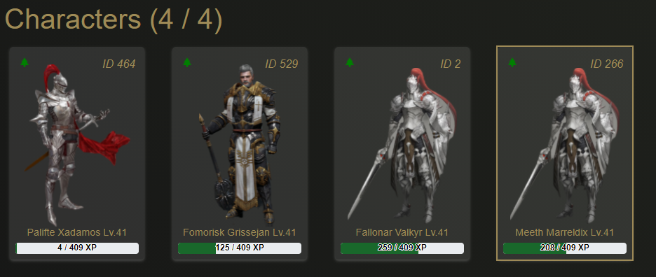

# What are Characters?

Characters are one of the main NFTs the player can possess in CryptoBlades. 

Each account can hold a maximum of four characters at any given time.

The price to mint characters is displayed on the button in the Plaza tab. All SKILL spent on minting characters gets sent to the contract that handles fight payouts.

Each character starts at level one, and comes with a random element upon minting.

Currently there is no way to change the element of a character.

## CBC

CBC stands for CryptoBlades Character, and are the character NFTs present on your wallet.

If you wish to have CBC visible on your MetaMask wallet, you may add the token through it's contract address found below:

> 0xc6f252c2cdd4087e30608a35c022ce490b58179b


Set the decimal to "0" if prompted.


## Character Elements

Each character comes as one of four different elements \(Fire, Earth, Lightning, Water\).

Character elements are used to determine advantage calculations and multipliers in combat.

More information on how character elements are used can be found here:



## Stamina

Each character has their own individual stamina pool, with a maximum count of 200.

Stamina regenerates at a rate of one point every five minutes.

Stamina is spent when the player engages in combat, at a rate of 40/80/120/160/200 stamina per fight depending on the player's selected stamina cost per fight.

This means that in 24 hours, each character can get 288 stamina which equates to 7.2 fights.

