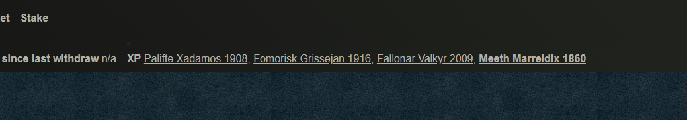

# Character Levels

Each character starts out at level one, requiring experience attained through successful combat to increase.

Character levels determine the amount of power they have during combat calculations, and in turn determines the SKILL payout on victories.

## Level Milestones

Level milestones are specific points where the character receives a large boost in power, and in turn increases their SKILL payout.

Currently milestones occur every ten levels, starting from 11 then 21, 31, 41, etc.

## Calculating Experience

To calculate whether or not it is time to claim, you can make a copy of the following spreadsheet:

Link to the spreadsheet here: [**CryptoBlades Experience Calculator**](https://docs.google.com/spreadsheets/d/1k3TZUTviY7DH7y4iqaVVuolHwi4GnGF7uudOxcLKUUc/edit?usp=sharing)\*\*\*\*

An overview of the experience table can be found below:



## Claiming Experience

Experience won through battles is stored in the Rewards bar, similar to SKILL.

As claiming experience costs a gas fee for the transaction, it is recommended to only claim your experience for a character if it will push them to the next milestone if the character in question is under level 41.

Past level 41, it becomes beneficial to claim their experience every level thereafter as the boost in power will result in more SKILL gained through fight payouts.


Often times due to varying win rates, character levels may become desynced.

It is always a good idea to claim experience before fighting with a character if that experience pushes them to the next milestone.

If other characters will not yet hit their respective milestones, it might be beneficial to stop fighting with that character and let others catch up assuming their stamina isn't full.


## Power Per Level

To calculate the amount of power a character gets at a certain level, we refer to the formula below:

$$
charPower = 1000 + ((charLevel - 1) * 10) * (Math.Floor((charLevel - 1) / 10) + 1
$$

More information on how character power is used to determine combat calculations and payouts can be found here:



