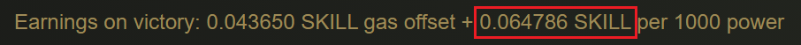
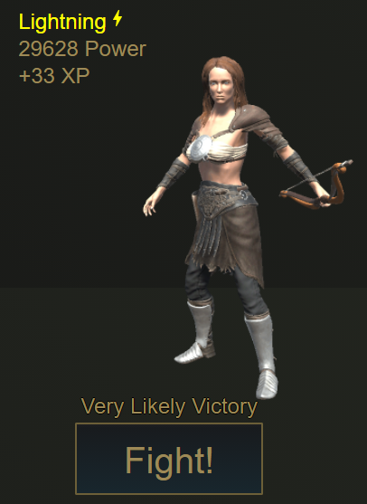
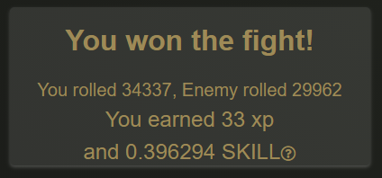

# Combat Rewards

## Experience Gained

Experience gained can be calculated by taking the Aligned Power and listed enemy power from the previous section and applying it to the formula below:

$$
expGained = Math.Floor((enemyPower / alignedPower) * 32)
$$

## Skill Payout

The formula to determine SKILL payout is as follows:

$$
payout = gasOffset + (baseline * √(enemyPower/1000))
$$

Gas Offset is shown in the earnings on victory display on the Combat tab as follows:

Baseline is shown in the earnings on victory display on the Combat tab as follows:

These numbers are subject to change in the future as the developers continue to balance the economic state of the game.

To give an example, let us use this enemy for the basis of our calculations:

29628 gets divided by 1000 to get 29.628.

We then get the square root of this value to get roughly 5.443161.

We multiply that value with the baseline rewards value at the time to get roughly 0.352641.

That gets added to the gas offset to get the expected payout of 0.396291.

As we can see below, we get a similar value when we actually perform the fight.

Decimal places and rounding gives a slightly different value from what we calculated, but overall it's close to our projected value.

