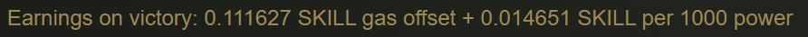
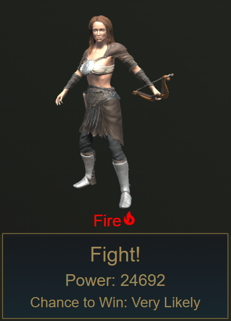
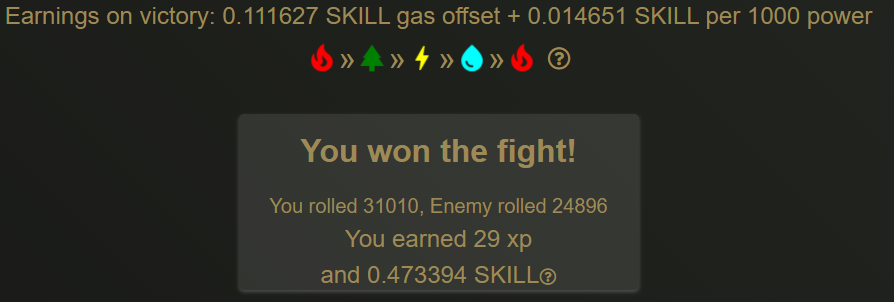

# Combat Rewards

## Experience Gained

Experience gained can be calculated by taking the Aligned Power and listed enemy power from the previous section and applying it to the formula below:

$$
expGained = Math.Floor((enemyPower / alignedPower) * 32)
$$

## Skill Payout

The SKILL payout formula is listed on the combat page at all times, and uses the enemy's listed power for calculation purposes. These numbers may change in the future depending on the economic state of the game.

To give an example, let us use this enemy for the basis of our calculations:

24692 gets divided by 1000 to get 24.692.

That value then gets multiplied by the listed payout per 1000 power. In this example's case, that comes out to 0.361762492.

That gets added to the gas offset, currently at 0.111627 to get the expected payout of 0.473389492.

Actually doing the fight, we end up with a result of

Decimal places and rounding gives a slightly different value from what we calculated, but overall it's close to our projected value.

