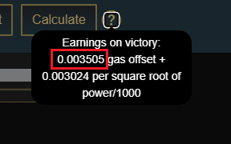
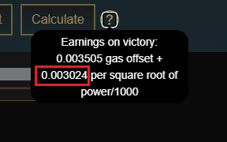

# Combat Rewards

## Stamina per Fight

Players may decide how much stamina they wish to spend on a single fight, and can spend up to 200 stamina in one go.

Gas offset is paid once per transaction, so if the user decides to spend 200 stamina they would receive 5x the evaluated baseline rewards, but gas offset only once.

The expected dollar value gains are equivalent for all tiers of stamina spending when accounting for gas, however earnings across an average period of time may differ if the player loses multiple high stamina fights.

Experience gained in fights are also multiplied proportionally depending on whatever stamina value the player chooses to spend.

## $XWeapon Payout

The formula to determine $XWeapon payout is as follows:

$$
payout = gasOffset + (baseline * √(enemyPower/1000))
$$

Gas Offset is shown in the earnings calculator as follows:

Baseline is also shown in the earnings calculator as follows:

These numbers are dynamically adjusted by the Oracle, taking into account SKILL dollar value.


Note that the "power" variable indicated in the formula is the listed power value of whatever enemy the player chooses to fight.


