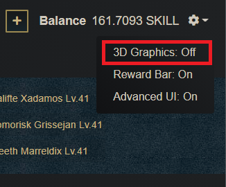
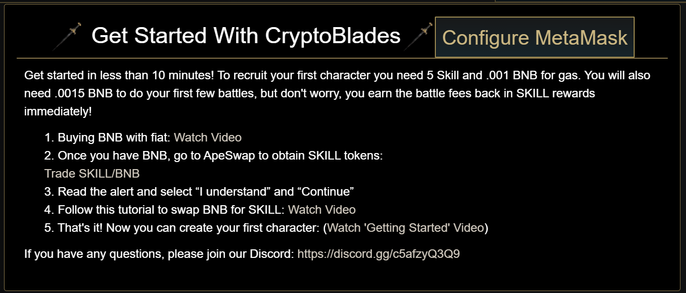

# Common Issues and Solutions

## Lag / Slow Loading

CryptoBlades NFTs are 3D assets that are rendered on screen. If this causes any lag or slowdowns you may disable 3D graphics by clicking the gear icon on the upper right side of the screen and turning 3D graphics off there.

## 0.285 Gas Fee

Whenever the user performs a transaction that isn't allowed by the contract, such as adding a 5th character, or trading away a trade locked weapon, they will get asked for a gas fee of 0.285 BNB.

Do not accept these transactions. Carefully evaluate what it is you're doing and confirm that your transaction is legal.

## EVM Error

Users have reported getting EVM errors mostly when performing fights before the hourly reset is done.

The enemy list refreshes every hour at UTC +0, and during the refresh the old enemy list disappears. If a fight transaction is in the middle of being calculated during this, the reference to the old enemy is lost and the transaction fails.

To avoid this, you can stop fighting before the hour is done to avoid any failed fight transactions and wait for the refresh to finish.

## Getting Started Page Stuck

To get past the initial welcome page, a minimum amount of SKILL is required to be present in your wallet indicated by the cost to recruit your first character.

Please proceed to the following page to learn how to purchase SKILL:



