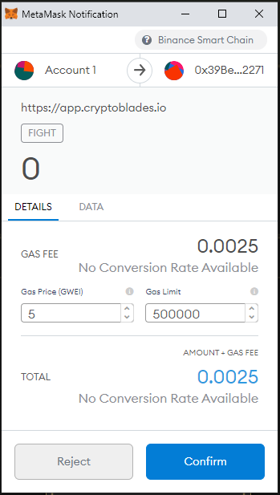
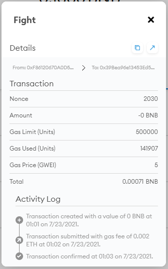

# Gas Fees

CryptoBlades operates purely on-chain, and due to this there is a necessity for gas fees to be constantly paid by the players using BNB.

Gas fees are necessary to conduct operations on the Binance Smart Chain, and operating on-chain through the use of [Chainlink's VRF](https://docs.chain.link/docs/chainlink-vrf/) technology ensures that all entropy-based gameplay scenarios such as minting NFTs or combat will always be provably fair.

Players are always required to hold an amount of BNB in your MetaMask wallet to ensure the capability of conducting transactions and interacting with the CryptoBlades smart contracts.

The gas fees usually cost around 0.0007 to 0.0010 BNB depending on the transaction, however certain transactions such as claiming experience can be higher depending on the numerical data involved.

Combat gas fees are listed at 0.0025, however that is just a maximum amount that the player may pay. The true gas costs of fights are around 0.0007 BNB which can be seen in your MetaMask transactions.

## Fight Gas Cost

Fighting prompts players for a set gas cost that is different from what is actually charged as displayed in the pictures below.

The actual gas cost for the transaction is a much lesser 0.0007 BNB on average as displayed in the next picture.

Gas costs for transactions are subject to volatility depending on network traffic on the Binance Smart Chain.

## Recommended BNB

Due to the implementation of Early Withdraw Tax, it is recommended that new players hold a decent amount of BNB to be used for gas fees.

The current recommended amount of BNB is 0.16, give or take a few skill depending on the needs of the player.

This amount will sustain a player for a week's worth of fights, currently costing around 0.142 BNB give or take a few BNB to account for network traffic.

The remaining BNB will be used for the various transactions a player might perform, such as claiming/staking SKILL, claiming experience, forging, etc.

