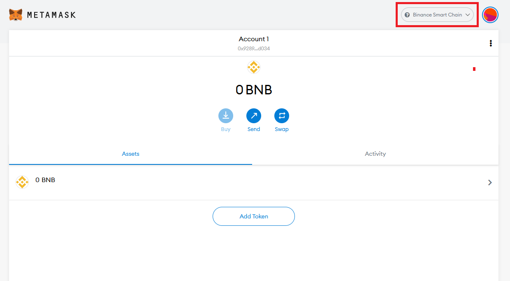

# MetaMask Wallet Setup

## Downloading and Installing MetaMask

[MetaMask](https://metamask.io/) can be downloaded as a browser extension on any compatible browser.

The links to download MetaMask can be found here for [**Chrome Web Store**](https://chrome.google.com/webstore/detail/metamask/nkbihfbeogaeaoehlefnkodbefgpgknn), [**Firefox Add-ons**](https://addons.mozilla.org/en-US/firefox/addon/ether-metamask/), and [**Edge Add-ons**](https://microsoftedge.microsoft.com/addons/detail/metamask/ejbalbakoplchlghecdalmeeeajnimhm).

MetaMask is also compatible with Brave browser.

MetaMask can also be installed on [**Android**](https://play.google.com/store/apps/details?id=io.metamask&hl=en_US&ref=producthunt&_branch_match_id=739701339152755845), and [**iOS**](https://apps.apple.com/us/app/metamask/id1438144202?_branch_match_id=739701339152755845).

## Creating an Account

Once MetaMask has been downloaded and installed, you may proceed to create an account.

The steps to create an account are outlined below:

1. Click on the "Create a Wallet" button.
2. Create a password. This will be used when logging in to MetaMask in the same browser.
3. View your secret seed phrase and write it down on a secure location.
4. Select each phrase in order and click "Confirm".


Your seed phrase will be used if you want to import your wallet to a fresh MetaMask install on a different browser and/or device.

Never give your seed phrase out to anyone. This can be used similar to your password to access your account.

CryptoBlades developers and moderators will never ask for your seed phrase and password.


## Connecting to the Binance Smart Chain

After you create an account on MetaMask, it will default to the Ethereum Mainnet.

CryptoWar and $XWeapon requires your wallet to be set to the Binance Smart Chain Mainnet.

The steps to add the BSC network are outlined below:

1. Go to the Settings menu by clicking on the circle in the upper right hand side of the screen.

2. Click on "Networks" and "Add Network".

3. Input the following information:

* Network Name : Binance Smart Chain
* New RPC URL : https://bsc-dataseed.binance.org/
* Chain ID : 56
* Currency Symbol : BNB
* Block Explorer URL : https://bscscan.com

4. Click "Save" and return to the main menu.

5. Verify that your MetaMask has been set to the Binance Smart Chain network in the upper right hand side of the screen.

Congratulations, you are now ready to receive BNB in your address and purchase SKILL.

