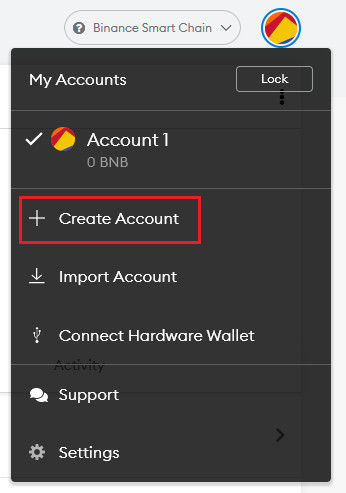
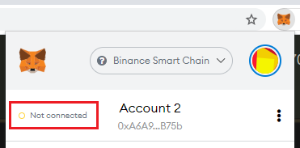
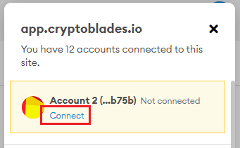

# Multiple Accounts

Having multiple accounts is allowed in CryptoWar, and is balanced through the use of the stamina time gate.

Each account of four characters is required to have their own weapon, as a 24 hour trade lock prevents the passing of one weapon to multiple accounts.

Each account also needs their own gas, and the more accounts you have the higher gas upkeep is required.

You may use a single MetaMask to house multiple accounts.

To create a new account, simply click on the circle icon on the upper right side of your screen and select "Create Account".

Sometimes, CryptoWar may not recognize a second account on the same MetaMask. To resolve this, click on the MetaMask icon in your browser's extensions tab and click on the "Not connected" text.

Click on the "Connect" button when prompted.

Once you are finished, CryptoWar should now detect your new account. If your new account is not yet reflected on the website, simply refresh CryptoWar

