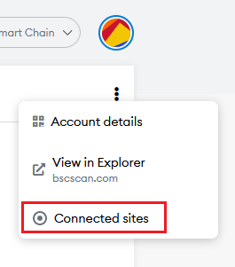
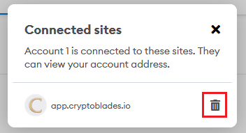

# Multiple Accounts

Having multiple accounts is allowed in CryptoBlades, and is balanced through the use of the stamina time gate.

Each account of four characters is required to have their own weapon, as a 24 hour trade lock prevents the passing of one weapon to multiple accounts.

Each account also needs their own gas, and the more accounts you have the higher gas upkeep is required.

You may use a single MetaMask to house multiple accounts.

To create a new account, simply click on the circle icon on the upper right side of your screen and select "Create Account".

Sometimes, CryptoBlades may not recognize a second account on the same MetaMask. To resolve this, go back to your primary account and click on the ellipsis button under the circle icon and select "Connected sites".

You will see a list of all websites that you have connected your MetaMask account with. Find the app.cryptoblades.io entry and delete it. This will not delete anything on your account, it will merely reset the linking process of CryptoBlades and MetaMask.

Once you are finished, proceed back to the CryptoBlades application. You will be prompted to once again connect your MetaMask. Select all your associated accounts and connect them.

If in the future you wish to add more accounts, you may have to repeat this process again to enable linking.

