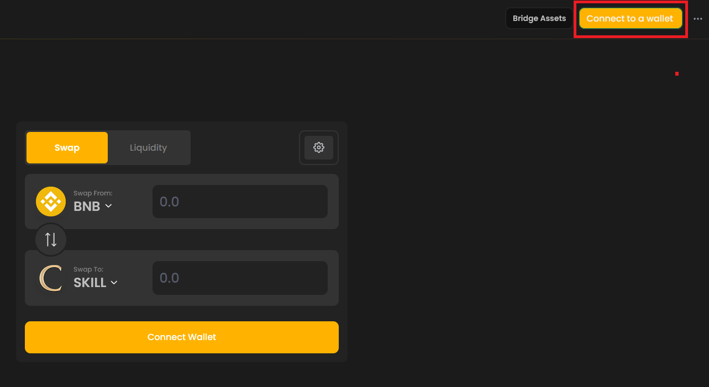
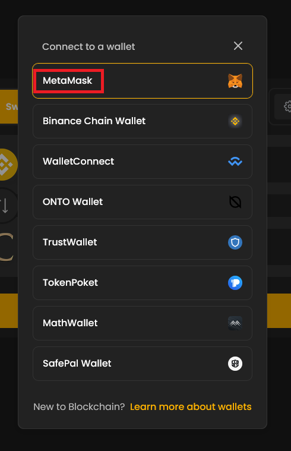
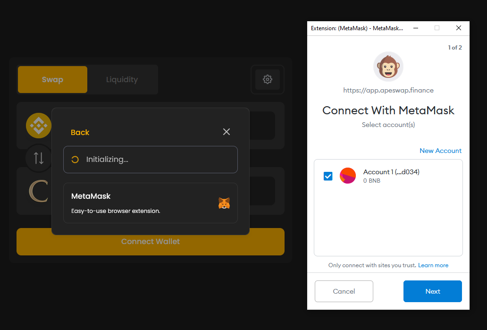

# Purchasing SKILL

Once your MetaMask has been connected to the BSC network and has received an appropriate amount of BNB, you may proceed to an exchange to purchase SKILL.

## Purchasing SKILL on a DEX

SKILL can be purchased on a decentralized exchange such as ApeSwap using BNB.

The steps to purchasing SKILL are outlined below:

1. Go to [**ApeSwap**](https://app.apeswap.finance/swap?outputCurrency=0x154a9f9cbd3449ad22fdae23044319d6ef2a1fab).

2. Click on the "Connect to a wallet" button on the upper right hand side of the screen.

3. Connect using your MetaMask wallet.

4. Proceed with any confirmations and wait for your wallet to connect to ApeSwap.

5. Make sure BNB is set on the "Swap From:" field on the upper portion of the interface.

6. Input the desired amount of BNB to spend.

7. Double check your values and once you are satisfied click on "Swap" and "Confirm Swap".


Be patient and wait for pending transactions to complete. Repeated clicking may cause multiple transactions to register and unnecessary gas fees might be paid.


Once your transaction has completed you should see your SKILL balance reflected in your MetaMask Assets tab.

If SKILL isn't listed on your assets, you may click "Add Token" and input the contract address for SKILL found below:

> 0x154a9f9cbd3449ad22fdae23044319d6ef2a1fab

