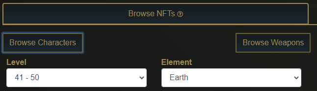
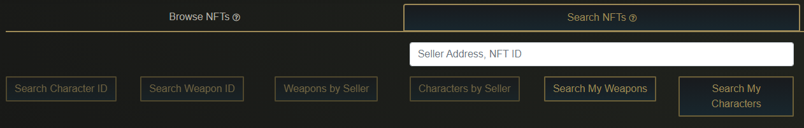
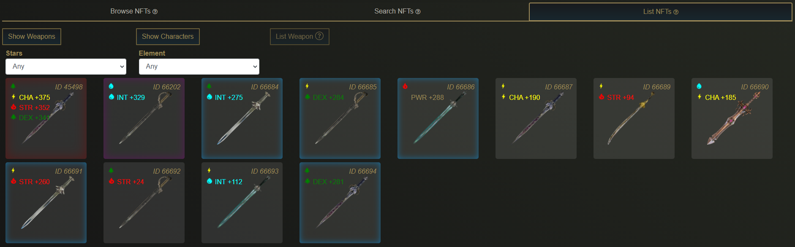

# Marketplace

CryptoBlades assets such as characters and weapons are user owned ERC-721 NFTs can be freely traded with other players.

To remove the possibility for scams when conducting trades through the use of the NFT contracts, CryptoBlades has a proprietary marketplace where users may list and purchase their NFTs.

## Tax

Listing an NFT only requires the gas fee necessary to conduct the transaction to transfer the NFT to the marketplace contract.

Purchasing an NFT from the marketplace incurs a 10% tax, paid for by the buyer.

The listed price of NFTs on the marketplace is tax-inclusive, and the 10% tax is redirected into the contract responsible for SKILL payouts through combat.

## Trade Lock

Items that are listed and bought via the marketplace, or traded via smart contracts will incur a 24 hour trade lock before the item can be listed or traded again.

This trade lock is necessary to prevent users from abusing the use of a single sword across multiple accounts.


Attempting to list or trade a locked item incurs a 0.285 gas fee error. Please do not attempt to bypass the 24 hour trade lock.


## Browse NFTs

The Browse NFTs tab lets you view the currently listed characters and weapons.

Filters are available for both characters and weapons to narrow down the available options.

Due to the current lack of pagination, only the first 60 pulled results will be displayed. If you wish to make a direct purchase of someone's listed NFT on the marketplace, you must obtain the asset ID and use the Search NFTs function detailed below.

## Search NFTs

If you have access to the asset ID of the NFT you are purchasing, or you have access to the wallet address of the seller, you may view them directly under the Search NFTs tab.

Simply input an asset ID on the textbox and select either "Search Character ID" or "Search Weapon ID" to bring up the NFT in question.

If you have the wallet address of the seller, you may also input that on the textbox and select "Characters by Seller" or "Weapons by Seller" to bring up all of their listed characters and weapons respectively.

You may also use this tab to view your currently listed characters and weapons, complete with their tax-inclusive price.

Selecting a listed NFT lets you de-list the item or adjust it's listed price. Note that the listed price adjustment makes you input a new price that will then get a 10% tax on top of it before it gets re-listed on the marketplace.


De-listing an item still incurs the 24 hour trade lock, so you won't immediately be able to trade or re-list the item after pulling it out of the marketplace.


## List NFTs

The List NFTs tab lets you list your own NFTs on the marketplace. You can view the characters and weapons on your wallet and list them at a price of your choosing.

Please note that the price you input upon listing is the amount of SKILL you receive. The actual listed price on the marketplace will have a 10% tax added on top of it.

Listing involves transferring the NFT from your wallet to the marketplace, and as such incurs a gas fee similar to trading. You will also be prompted to allow CryptoBlades approval to use your CBC or CBW.


Listing a character frees up a space in your wallet, and allows you to mint a new one.

Please note that you cannot de-list a character if your current wallet is already 4/4 characters.


