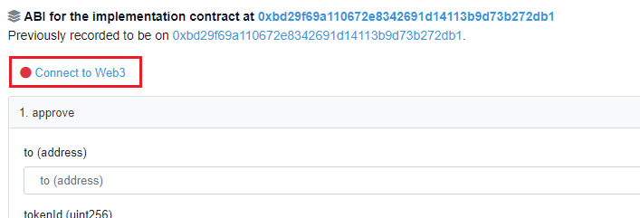
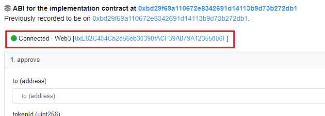
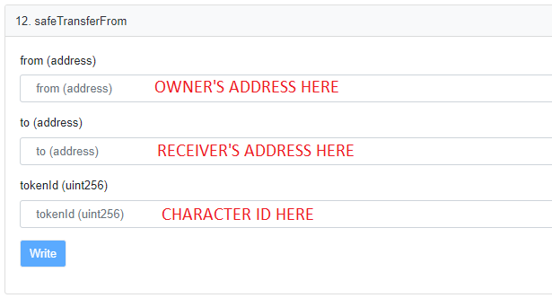
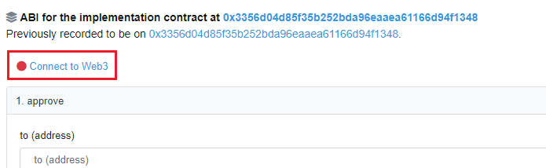
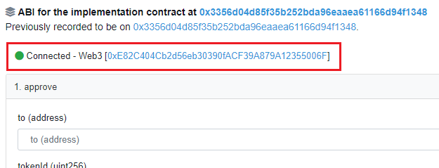
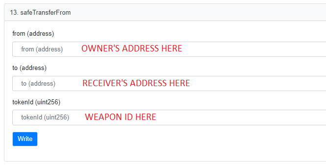

# Trading

Owing to the player owned nature of NFT assets, players may freely trade with one another outside the marketplace through the use of the NFT smart contracts.

NFTs traded through the use of smart contracts incur the same 24 hour trade lock.


Please note that it is possible for you to be the target of scams and frauds when conducting peer to peer trading.

The CryptoBlades team takes no responsibility and are unable to provide assistance if you have lost SKILL or NFTs through peer to peer trading.

To ensure smooth trading with no risk, please conduct trades through the CryptoBlades marketplace.


## Trading Characters

Trading characters takes place on the character contract, which can be found in the link below. Note that this is different from the weapon contract.

[CryptoBlades Character Trading Contract](https://www.bscscan.com/address/0xc6f252c2cdd4087e30608a35c022ce490b58179b#writeProxyContract)


Please note that this link is different from the weapon trading contract.

You cannot trade weapons on the character contract.


To start, please ensure that the receiving wallet has an extra character slot, and the character in question is not under trade lock. If the following conditions are met you may follow the instructions outlined below.

1. Click on "Connect to Web3" as shown in the picture below. Do this until it reflects the address of your current MetaMask account.

2. Scroll down to Function 12. safeTransferFrom and input the following data:

* from \(address\) - The owner's address goes here
* to \(address\) - The receiver's address goes here
* tokenID \(uint256\) - The character ID goes here

3. Click on "Write". You will be prompted by MetaMask to confirm your transaction.

4. Pay the gas fee and wait for your transaction to complete.


Make sure that the account in possession of the character is the one connected to the contract page.


## Trading Weapons

Trading weapons takes place on the weapon contract, which can be found in the link below. Note that this is different from the character contract.

[CryptoBlades Weapon Trading Contract](https://www.bscscan.com/address/0x7e091b0a220356b157131c831258a9c98ac8031a#writeProxyContract)


Please note that this link is different from the character trading contract.

You cannot trade characters on the weapon contract.


The steps to trade weapons is identical to character trading, except the function is number 13 instead.

1. Click on "Connect to Web3" as shown in the picture below. Do this until it reflects the address of your current MetaMask account.

2. Scroll down to Function 13. safeTransferFrom and input the following data:

* from \(address\) - The owner's address goes here
* to \(address\) - The receiver's address goes here
* tokenID \(uint256\) - The weapon ID goes here

3. Click on "Write". You will be prompted by MetaMask to confirm your transaction.

4. Pay the gas fee and wait for your transaction to complete.


Make sure that the account in possession of the weapon is the one connected to the contract page.


