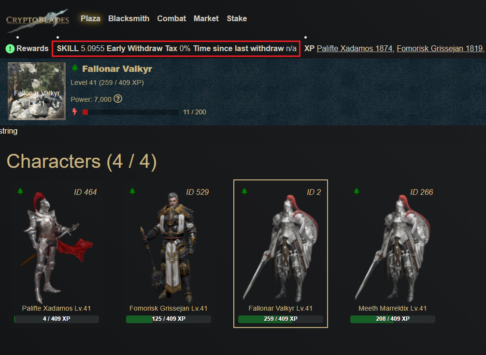

# Obtaining SKILL

SKILL is primarily obtained through successful combat encounters, and the trading of NFTs on the marketplace. Over time, more features that reward SKILL will be developed to further increase the value of NFTs necessary to produce SKILL.

## Fights

Players can use their character and weapon NFTs to fight in the Combat tab of the application.

Fights are an on-chain transaction that takes the power values of the chosen character and chosen enemy, and compares the calculated rolls to determine if the player wins or loses.

Information on the combat calculations can be found here:



## Claiming SKILL

SKILL won through combat will be reflected in the player's Rewards bar on the upper left hand side of the screen. If the Rewards bar is not visible, you may select the gear icon on the upper right hand side of the screen and enable the Rewards bar.

When the player decides to mint a new character or weapon, CryptoBlades will take SKILL from the player's Rewards pool before spending any SKILL on their wallet.

## Trading

Players may trade their NFTs on the marketplace for SKILL.

Information on the marketplace can be found here:



Players may also conduct peer to peer trades through the use of the NFT contracts.

Information on player trading can be found here:



