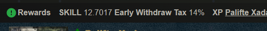

# Obtaining SKILL

SKILL is primarily obtained through successful combat encounters, and the trading of NFTs on the marketplace. Over time, more features that reward SKILL will be developed to further increase the value of NFTs necessary to produce SKILL.

## Fights

Players can use their character and weapon NFTs to fight in the Combat tab of the application.

Fights are an on-chain transaction that takes the power values of the chosen character and chosen enemy, and compares the calculated rolls to determine if the player wins or loses.

Information on the combat calculations can be found here:



## Earnings Calculator

CryptoBlades has a built in calculator where the player may input a dollar value for both SKILL and BNB, and then the stats of their current character and selected weapon.

The calculator will then show the potential daily and monthly earnings based on a specific amount of wins compared to the total daily fights.


The calculator does not take into account the potential of the character to level. Due to the speed at which starting characters level up, it might be good to do new calculations when the character in question reaches the next milestone.


## Claiming SKILL

SKILL won through combat will be reflected in the player's Rewards bar on the upper left hand side of the screen. If the Rewards bar is not visible, you may select the gear icon on the upper right hand side of the screen and enable the Rewards bar.

Claiming SKILL from the rewards pool may subject the player to the Early Withdraw Tax, explained in the section below.

## Early Withdraw Tax

Each player is subject to a Early Withdraw Tax that disincentivizes the rapid withdrawing and selling of SKILL on a day to day basis.

The tax initially starts at 15%, reducing by 1% per day until it hits 0%.

Each time the player withdraws SKILL, or stakes unclaimed SKILL on the staking pool, the tax resets back to 15%.

Users who wish to avoid the tax may find some more information on the staking page, found here:



## Trading

Players may trade their NFTs on the marketplace for SKILL.

Information on the marketplace can be found here:



Players may also conduct peer to peer trades through the use of the NFT contracts.

Information on player trading can be found here:



