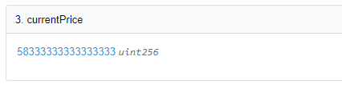
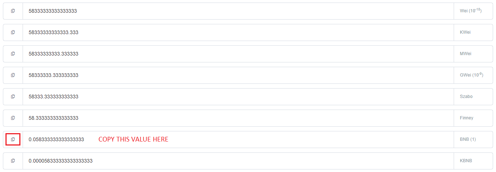

# Oracle

## Purpose

The price oracle's purpose is to balance the SKILL payout gained through combat, along with minting and reforging costs to the current dollar value of SKILL.

This means that the following will happen if the dollar value per SKILL **increases**:

* SKILL payouts decrease
* Mint Character costs less SKILL
* Mint Weapon costs less SKILL
* Reforge costs less SKILL

Conversely, if SKILL price in dollar falls under a specific amount the opposite of the above becomes true.

## Reason

The reason for the oracle's usage is so that the economy of the game is balanced around a set dollar value. There is a limited amount of SKILL token that can circulate in the economy, and an increase in users would likely drain all the SKILL present in the game contract.

By utilizing the oracle, CryptoBlades forms a correlation between active users and the dollar value of SKILL. The assumption is that when SKILL price rises, the demand for SKILL increases as well through the release of new game features or an influx of new players.

The oracle will ensure consistent dollar value payouts per fight transaction at the time it was made, along with ensuring mint costs for NFTs remain at a consistent dollar value. This means that entry costs can be balanced and kept low enough to allow new players a chance to play even if the dollar value of SKILL rises.

## Obtaining Oracle SKILL/Dollar Rate

The oracle keeps track of the current dollar value of SKILL, and updates at an undisclosed rate to prevent players from taking advantage of the fluctuations in SKILL/Dollar price.

To get the current rate of the oracle, follow the steps outlined below:

1. Go to the oracle contract here : [**Oracle**](https://bscscan.com/address/0x1cbfa0ec28da66896946474b2a93856eb725fbba#readProxyContract)\*\*\*\*

2. Click on the number indicated by Function 3. currentPrice.

3. Copy the value indicated in the BNB \(1\) row.

4. Divide 1 by that copied value. The result is what the oracle thinks SKILL is currently worth in dollars.

If the calculated amount is different from the actual dollar value of SKILL you can expect nerfs to payouts and cheaper mint costs if the oracle is under ****the current value of SKILL, and the opposite if the oracle is over the current value of SKILL.

