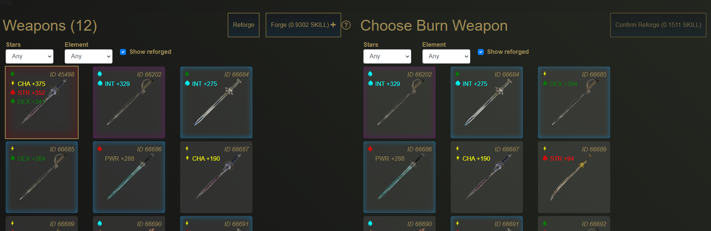
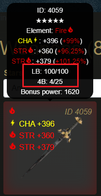
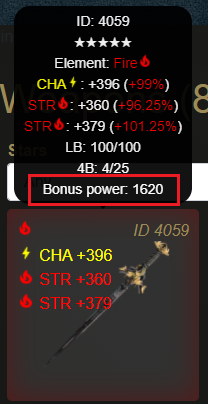

# Reforging

Reforging weapons is the process of spending SKILL tokens to burn one weapon into another. The target weapon receives bonus power, and the burned weapon disappears.

Alongside weapon forging, reforging serves as one of the two SKILL sinks in the game. Reforging also gives value to the massive amounts of one to three star weapons that a player may receive when trying to forge for four or five stars.

## LB, 4B, and 5B

A reforged weapon displays new information when hovered over. This is the LB, 4B, 5B, and Bonus Power.

LB stands for _Low Star Burn_ and is the total value of one to three star weapons burnt.

4B stands for _Four Star Burn_ and is the total value of four star weapons burnt.

5B stands for _Five Star Burn_ and is the total value of five star weapons burnt.

## Bonus Power

Bonus Power is a new stat gained when reforging that is used alongside weapon attributes to determine player power for combat rolls.

More information on how Bonus Power is used can be found here:



## Burn Value

The rarity of the burnt weapon determines which burn pool the value goes to, and for the case of LB determines the amount of burn points to add.

LB, 4B, and 5B have a maximum limit independent of one another, and each point increase in each respective pool contributes to the weapon's total Bonus Power.

Refer to the following table for maximum amount of burn points and the bonus power per point received.

| Burnt Weapon Rarity | Pool | Maximum Pool Value | Bonus Power Per Point | Maximum Bonus Power |
| :--- | :--- | :--- | :--- | :--- |
| 1-star, 2-star, 3-star | LB | 100 | 15 | 1500 |
| 4-star | 4B | 25 | 30 | 750 |
| 5-star | 5B | 10 | 60 | 600 |

This means that a fully reforged weapon can have a maximum of 2850 bonus power.

## Burn Conditions

Depending on the rarity of the weapon and the current value of the pool, the amount increased per burn may change.

Refer to the following to determine how much the pool will increase when the respective weapon rarity is burnt.

* 1-star weapon burns increases LB by two if the LB is under 10, otherwise it increases it by one.
* 2-star weapon burns increases LB by two if the LB is under 30, otherwise it increases it by one.
* 3-star weapon burns increases LB by four if the LB is under 50, otherwise it increases it by two.
* 4-star weapon burns always increases 4B by one.
* 5-star weapon burns always increases 5B by one.


Due to the conditions present in LB reforging under 50/100 LB, the optimal way to reforge a weapon starting from 0/100 LB is as follows.

1. Burn five 1-star weapons to increase the LB from 0 to 10.
2. Burn ten 2-star weapons to increase the LB from 10 to 30.
3. Burn five 3-star weapons to increase the LB from 30 to 50.
4. From 50/100 LB onwards you may burn your choice of 1 to 3 star weapons.


