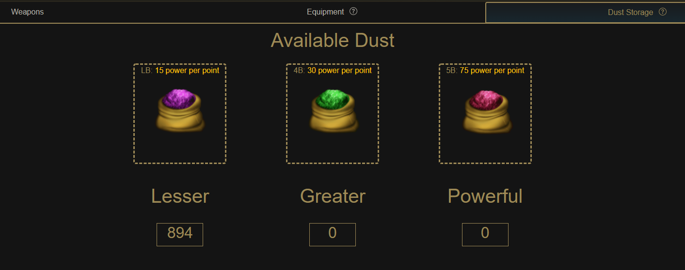

# Dust

Dust is a resource obtained by burning weapons to get their respective dust counterparts.

## Acquiring Dust

Dust comes in three forms, **Lesser Dust**, **Greater Dust**, and **Powerful Dust** which can be obtained by burning 1-3 star weapons, 4 star weapons, and 5 star weapons respectively.

The amount of dust you receive depends on the rarity of the weapon burned, and any on-going promotions such as a reforge event.

Under normal circumstances, players are expected to receive the following amounts of dust when burning a weapon:

| Burnt Weapon Rarity | Dust Received | Amount Received |
| :--- | :--- | :--- |
| 1-star | Lesser | 1 |
| 2-star | Lesser | 2 |
| 3-star | Lesser | 3 |
| 4-star | Greater | 1 |
| 5-star | Powerful | 1 |

Dust can also be given out as a reward in Raids, and potentially other sources as more features are developed.

## Functionality

Dust functions the same as as burning a similar rarity weapon for reforging, with the added benefit of batched transactions rather than manually burning one weapon at a time. There is also a side benefit of cleaning up a player's blacksmith page instead of showing hundreds of weapons.

More information can be found in the Reforging page here:



