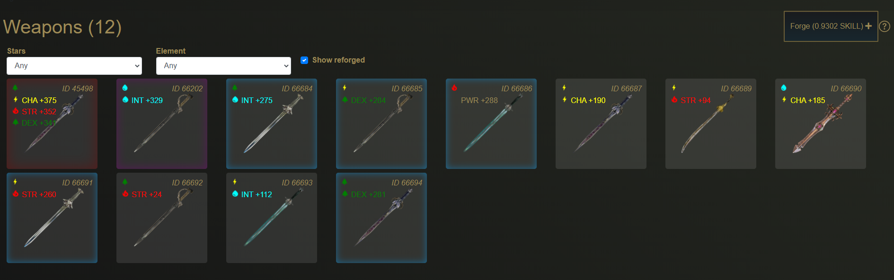
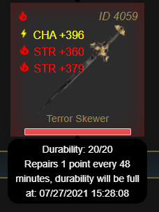

# What are Weapons?

Weapons are one of the main NFTs the player can possess in CryptoWar 

Unlike characters, each account can hold an unlimited amount of weapons.

The price to mint weapons is displayed on the "Forge" button in the Blacksmith tab.

Each weapon comes with a random element and a random rarity denoted by the amount of stars it possesses. The rarity of the weapon determines the amount of attributes it has and the values that these attributes may roll.

The usage of a weapon is not tied to a character, so one weapon may be used by all four of your characters.

Currently there is no way to change any of the values the weapon may roll.

## CBW

CBW stands for CryptoWar Weapon, and are the weapon NFTs present on your wallet.

If you wish to have CBW visible on your MetaMask wallet, you may add the token through it's contract address found below:

> 0x7e091b0a220356b157131c831258a9c98ac8031a


Set the decimal to "0" if prompted.


## Weapon Durability

Weapons have durability, which serves to limit how often a weapon can be used to prevent people from simply passing one weapon around to multiple accounts.

Durability recovers at a rate equal to character stamina, so a single account can use a single weapon for fighting with four characters.

Durability has no effect on win rate, or the effectiveness of any weapon when used in combat.

## Weapon Minting

Minting weapons serves as the primary $XWeapon sink of the game along with Reforging. All $XWeapon spent on minting weapons gets sent to the contract that handles fight payouts.

The rarity of a weapon is randomly determined upon minting. Currently the rates of each rarity is as follows:

* 1% chance for a 5 star weapon
* 5% chance for a 4 star weapon
* 15% chance for a 3 star weapon
* 35% chance for a 2 star weapon
* 44% chance for a 1 star weapon

There is currently no pity system, or a form of guarantee that a specific amount of rolls will yield a specific rarity of weapon.

## Weapon Elements

The element of a weapon is randomly determined upon minting. Weapons share the same elements as characters \(Fire, Earth, Air, Water\).

The element of the weapon is used for calculating the player roll for combat.

More information on element matching can be found here:



