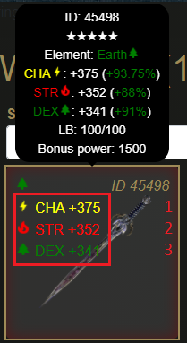
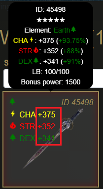

# Weapon Attributes

Weapon attributes are the different stats found under a weapon, and are used in conjunction with character power to determine the player's rolls for combat.

Each attribute comes with an element pairing and a numerical value.

## Attribute Count



The rarity of the weapons is used to determine the amount of attributes each weapon has according to the table below.

| Weapon Rarity | Number of Attributes |
| :--- | :--- |
| 1-star, 2-star, 3-star | 1 |
| 4-star | 2 |
| 5-star | 3 |

## Attribute Element


Attributes come in five different forms, with four of the five having a specific element pairing and one attribute being neutral. Refer to the table below for element pairings.

| Attribute Name | Element Pairing |
| :--- | :--- |
| STR | Fire |
| DEX | Earth |
| CHA | Lightning |
| INT | Water |
| PWR | Neutral |

Pairing attributes to the character element only affects the chance of winning when using that weapon in combat. More information on combat calculation can be found here:



## Attribute Value



Each attribute also has a numerical value attached to it that is randomized from a minimum and maximum roll that is determined by the weapon rarity. Refer to the table below for stat values.

| Weapon Rarity | Minimum Roll | Maximum Roll |
| :--- | :--- | :--- |
| 1-star | 4 | 200 |
| 2-star | 180 | 300 |
| 3-star | 280 | 400 |
| 4-star | 200 | 400 |
| 5-star | 268 | 400 |

Attribute values are used alongside character stats in determining the following:

* Total attribute values along with character power is used to determine the power ranges of targets in combat.
* Total attribute values along with attribute elements and character power is used to determine the rolls the player may have when fighting an enemy.

More information on combat calculations can be found here:




For practical purposes in evaluating weapons, the Displayed Percentages explained in the section below will be more beneficial to the average player.


## Displayed Percentages


When hovering over a weapon with a character selected, the player will find a percentage value next to each attribute.

These percentages are used to quantify the impact that particular attribute has when considering the element of the selected character.

The formula to determine that percentage in decimal form is outlined below.

```text
if attributeElement != charElement (attributeValue * 0.0025)
if attributeElement == PWR (attributeValue * 0.002575)
if attributeElement == charElement (attributeValue * 0.002675)
```

This means that the maximum displayed percentage would be 107% for a paired attribute with a value of 400.


For the purposes of determining the value of a weapon, it would be easier to total the percentages displayed when viewing the weapon with the character to be used.

A high total percentage would mean that on average, fights with that weapon would receive a higher payout on victory.

Attribute element is still important when it comes to win rate, however this can be solved through careful selection of opponents.


